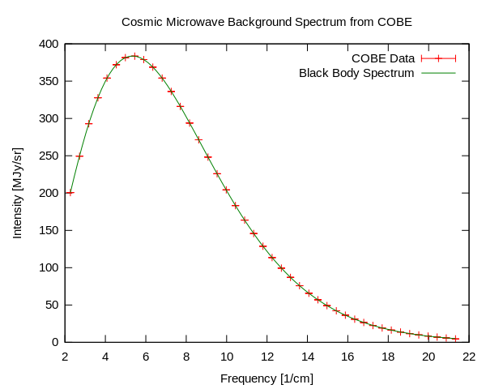

# To bring: 

* Ukulele
* IR thermometer
* Contigo mug + Knoxville Mercury coffee mug

# Announcements:

* Canvas discussion board; review of "muddiest" issue in previous lecture
* Homework: Due Sept 7
    * Policy: it is acceptable to do these as a group
    * Include name of each group member on document
* Seriously, spend time with the homework key

# Quiz

# Lecture

## Radiative transfer

* Heat is energy of molecules bouncing around
    * The more bouncing energy, the hotter the thing is
    * Thus "a thermometer is like an atomic speedometer" because temperature is just a measure of the speed, or bounciness, of atoms and molecules.
* You can transfer heat in 3 ways
    * Conduction: molecules bounce into each other, thus spreading the bounciness
    * Convection: bouncy molecules move from one place to another. (A game of Hot Potato is an example of conduction.)
    * **Radiation**: Atomic bounciness is transformed into light, which strikes a different atom, making the second atom bouncier.
* In space, there are no atoms to bounce. **The only way to transfer heat energy across a vacuum is by radiation.**
    * This is why a really good Thermos works: There's only one way to transfer heat energy across a vacuum, instead of 3.

## Light and energy

* All waves follow the relationship $\lambda = \frac{c}{\nu}$ where $\lambda$ is the wavelength (m or cm), $c$ is the speed of the wave (m/s or cm/s) and $\nu$ is the frequency ($\nu$)
    * Remember that all of these are also related to wavenumber $n$, by $n = \nicefrac{1}{\lambda}$
    * See Archer Fig. 2-1
* Higher frequency (shorter wavelength, higher wavenumber) light carries more energy, according to the relationship $E = h\nu = \nicefrac{hc}{\lambda}$, where $h$ is a fundamental constant called Planck's constant.
    * Q: what is the relationship between energy and wavenumber?
*  We use different names to talk about light with different wavelengths/wavenumbers/frequencies - **but fundamentally they are just different colors of light**
```
Group question: Why does my Contigo coffee mug so much better than my
Knoxville Mercury coffee mug at keeping my coffee hot?
```

## Blackbodies, or Why is everything lit up all the time?


* (Draw organic molecule) Chemical bonds are what hold molecules together.
* Archer uses the metaphor of weights on a spring for chemical bonds. I like to use the metaphor of a guitar, but really they're communicating the same idea.
* Chemical bonds act like little guitar strings - they tend to 'ring' at certain frequencies (see Archer Fig. 2-3)
* Light can 'ring' these guitar strings - that is, if light of a given frequency strikes a molecule that 'rings' at that same frequency, the light will transfer its energy to the molecule, thus heating it up
* **THIS RINGING GOES BOTH WAYS**: If a bond can 'ring', it can be 'rung'; this fact is known as the Kirchoff effect. That is to say, if a bond can absorb energy from light, it can lose energy by emitting light. **That is why all objects emit light, just due to the fact that they have a temperature.**
* We imagine a theoretical object that can ring perfectly well at all frequencies. We call that theoretical object a "blackbody".
    * There's no such thing as a "perfect" blackbody, but most solids and liquids are "good" blackbodies - that is to say, they can absorb and emit light pretty well at most frequencies.
    * Remember the Stefan-Bolzmann equation: $I = \epsilon \sigma T^4$. The emissivity, $\epsilon$, is an indicator of how good of a blackbody the object is. (1 = perfect blackbody, 0 = worst possible blackbody). 
```
Group question: What is the temperature of the universe? (See fig below)
```

## Some more formulae - only pay attention to these if you feel like it
* A few other useful relationships (don't memorize these, but if you spend some time with them, they might help you understand blackbody radiation a bit better)
    * Wien's displacement law: the wavelength at which maximum intensity per unit wavelength is emitted is given by:
$$
\lambda_{max} = \frac{2.9 \times 10^{-3} \textrm{K}\cdot \textrm{m}}{T}
$$
    * Spectral radiance $B$ as a function of wavelength and temperature is given by:
$$
B_{\lambda, T} = \frac{2hc^2}{\lambda^5}\frac{1}{e^\frac{hc}{\lambda k_bT}-1}
$$


## One of the most amazing plots in all of science:



